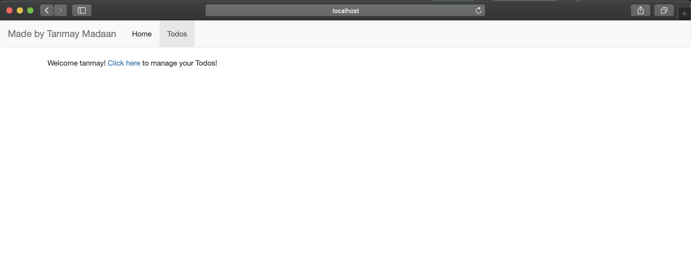
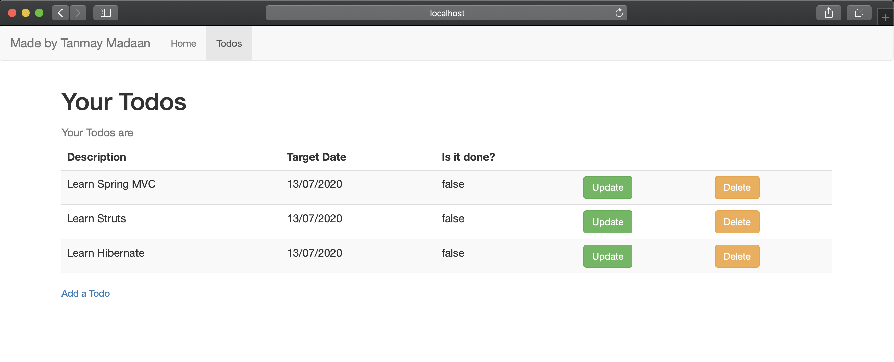
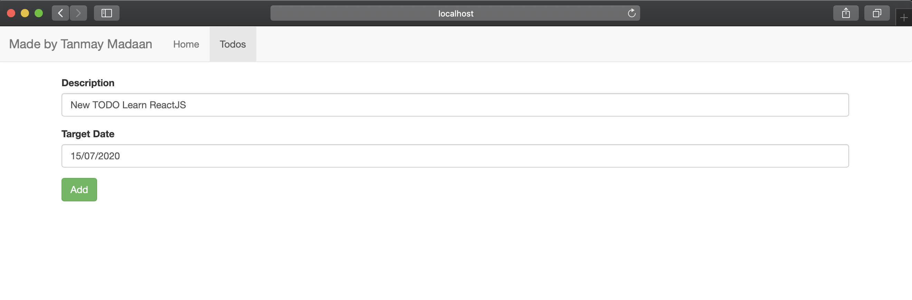
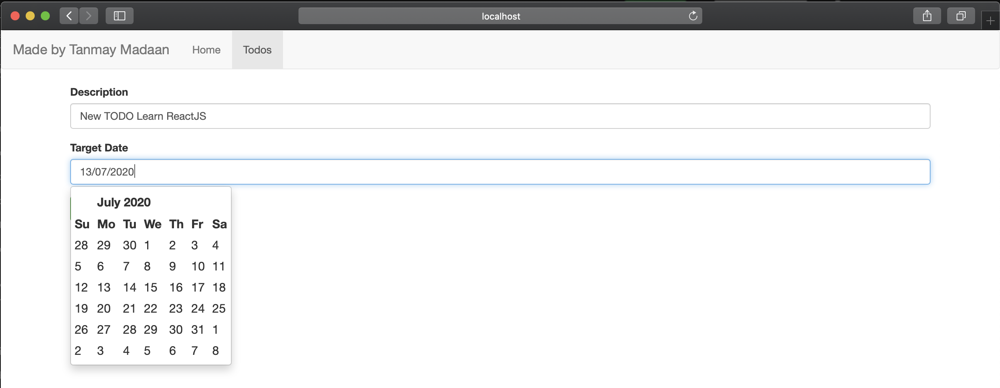

# TODO using Spring Boot
A TODO application built using Spring Boot.

## Dependencies Used:
- Spring Boot Web Starter
- Spring Boot DevTools
- Bootstrap and jQuery webjars for UI
- JSTL for Form formatting
- Bootstrap DatePicker for Add TODO

## Screenshots:

